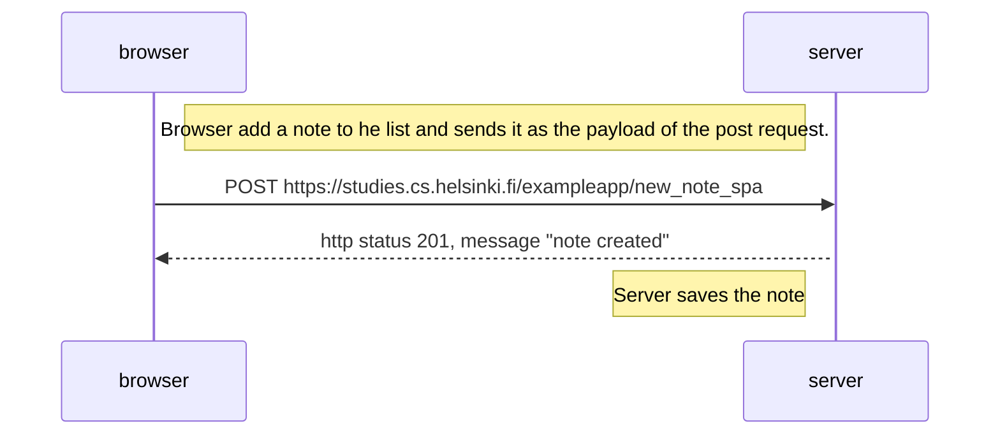

```mermaid

sequenceDiagram
    participant browser
    participant server

    Note right of browser: Browser add a note to he list and sends it as the payload of the post request.

    browser->>server: POST https://studies.cs.helsinki.fi/exampleapp/new_note_spa
    activate server
    server-->>browser: http status 201, message	"note created"

    Note left of server: Server saves the note

```